# Week 1 Lab Report - Arthur
## Step by step instruction to setup github and ssh  

>### Part 1 : Installing VScode
>>Go to the [Visual Studio Code](https://code.visualstudio.com/) website and follow the instruction to download and install VS IDE into your computer. Please pick the version that support your operating system, such as OSX (Max) and Windows (PC). After following the instruction and installing VS Code you will have the following page in your screen
>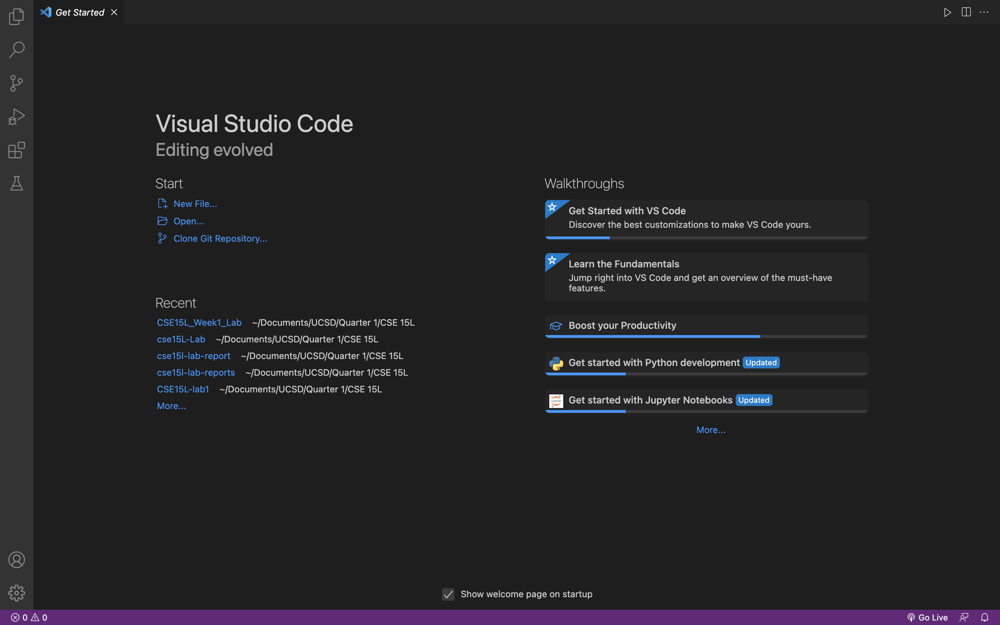
---

>### Part 2: Remotely Connecting 
>> If you you are in windows please install a program called [OpenSSH](https://code.visualstudio.com/), if you are in mac you can go open into your **terminal**. To connect to the virtual machine you can type the following command ( **ssh cs15lfa22xx@ieng6.ucsd.edu** ), the "xx" must be replaced by your course-specific account. Then it will give a message such as the following image;
>
type in yes and press enter, afterward place in your password, which will lead you to the server such as the following image;
>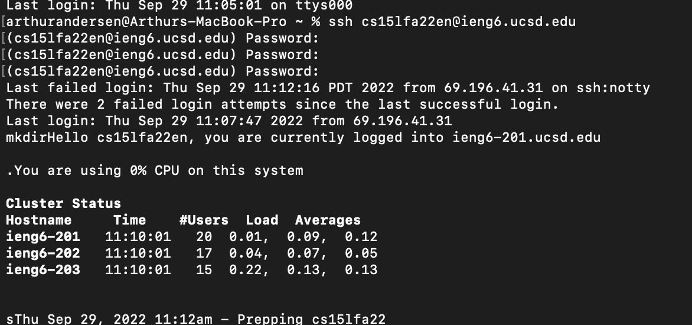
now you are log in to the virtual machine.
---

>### Part 3 : Trying Some Commands
>>There are lots of command code that can be use some that are often being used are **cd, ls, pwd, mkdir, and cp** , where it can be user on local and remotely. Here are some of the command being used;
>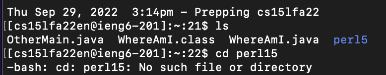
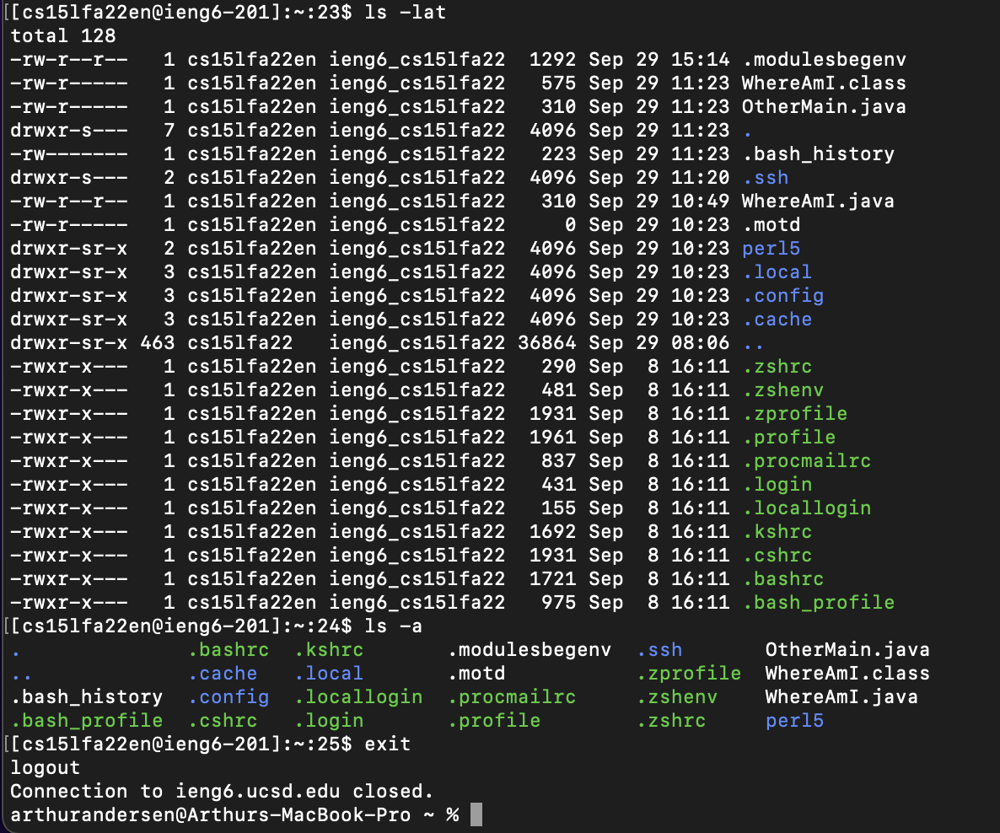 
>>- ls (library search),
>>- cd ()  
>>- ls ~lat (library search),
>>- ls -a ()
>>- exit or command + d, it will 
---

>### Part 4: Moving Files with **scp**
>> We will use the **scp** command , that works to copy a file or more from your computer to the virtual machine. It will be run through the *client*. This can be shown through the following example;
creating a new file called WhereAmI.java
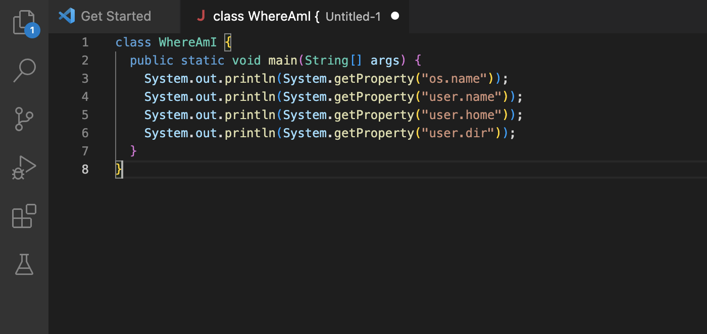
Then, after creating and saving the java file, you can continue by compile and the WhereAmI program using the **javac and java** respectively.
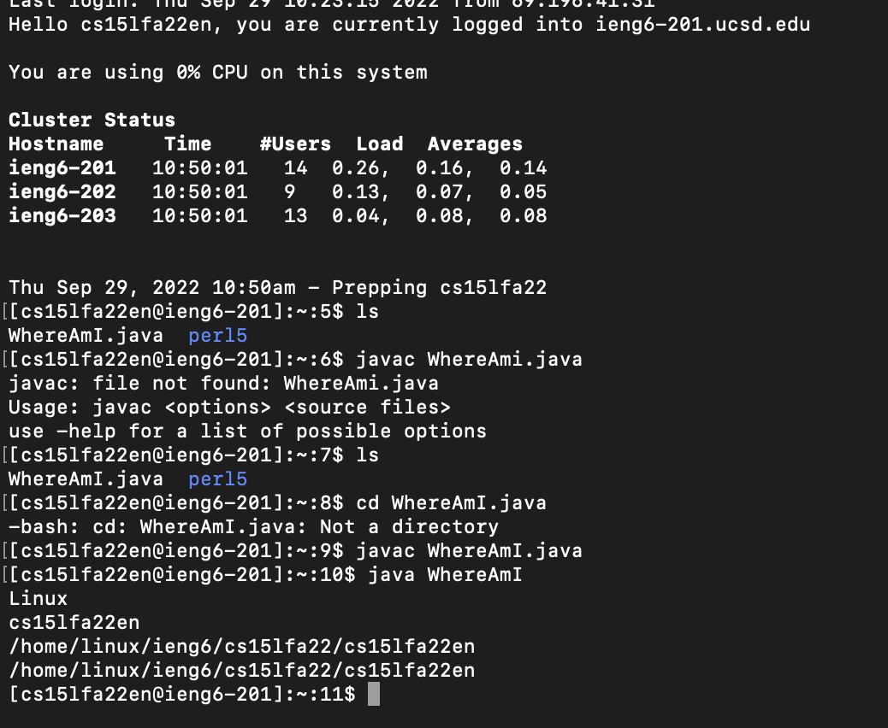
As shown by the image shows that program was run and shows the property of the computer called by the **getProperty** method in the program.
---

>### Part 5 : Setting SSH Key
>>Everytime we want to run to the remote machine, there are lots of repetitive steps one of the is logging in and typing the password. One solution is to use **ssh keys**, where by calling **ssh-keygen**, it will create a public and private key. you can copy the public key and place the private key on the client, so you would no longer need to type in the password when you log in to the server. The following image shows the step of creating the keys;
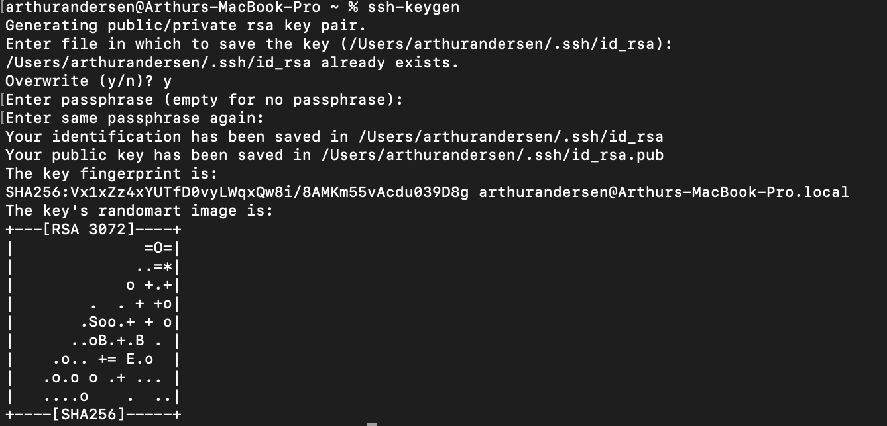    
Afterward, you can login to the remote machine to copy the public key to the **.ssh** directory of the user, by calling the **mkdir .ssh** command.
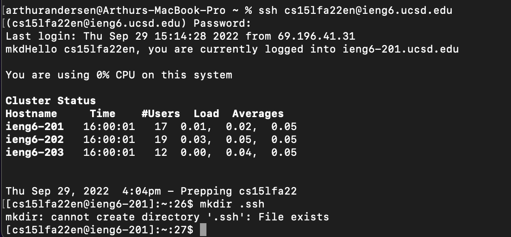  
Finally you can copy it back to the local device  
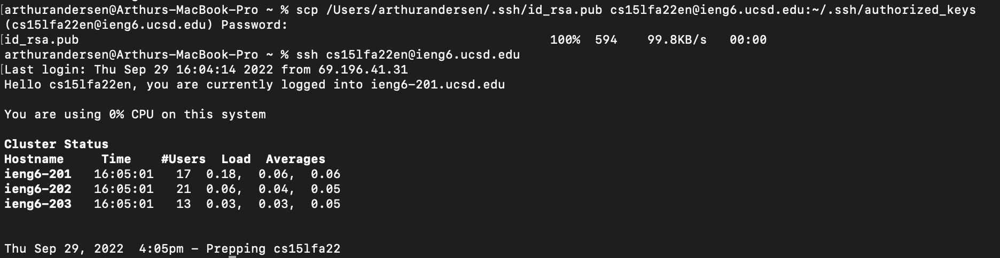  
In the final image, it shows that when you log in to the remote server, it won;t no longer need to type in your password
---

>### Part 6: Optimizing Remote Running
>> There are some method that can help you optimize to run the program more optimize such as the following example  
>>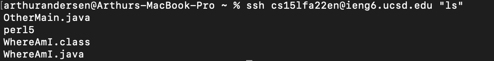   
>> One way is to bind to command in one single command line such as the top example. Where by calling "**ssh**" then adding **"ls"** at the end of the command, it shows that after connecting to the remote service, it directly open the library search command, showing all of the file in the directory.  
>>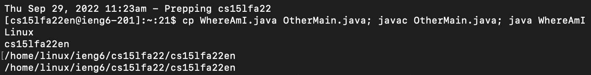  
>> The other was is to use the cursor to search previous comman, without retyping it